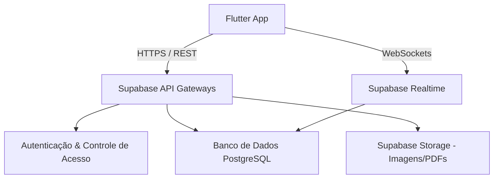
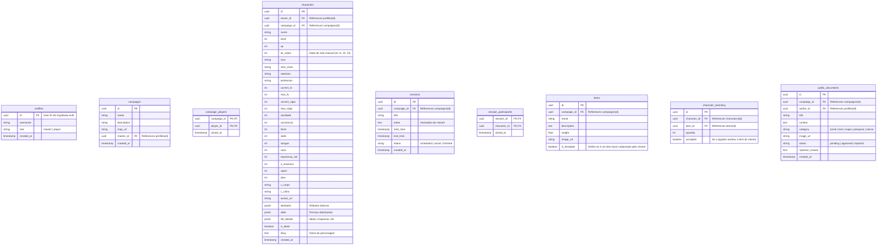

# Arquitetura Geral do Sistema (General Architecture)

Este documento descreve a arquitetura para o aplicativo mobile de gerenciamento de fichas do RPG **Despertar do Caos**. O projeto é estruturado para fornecer uma experiência em tempo real e de alta performance para até 10 usuários simultâneos (jogadores e mestre).

---

## 1. Visão Geral da Tecnologia

O ecossistema é dividido em duas partes principais:

*   **Frontend (Cliente)**: Aplicativo mobile multiplataforma construído em **Flutter** (iOS/Android).
*   **Backend (Servidor)**: Backend-as-a-Service (BaaS) gerenciado pelo **Supabase**.



### Tecnologias do Backend (Supabase)
1.  **PostgreSQL**: Banco de dados relacional robusto. Armazena o estado das fichas, sessões e campanhas.
2.  **Realtime WebSockets**: Sincroniza em tempo real as alterações de FV (vida), vigor, radiação, caos e sobrecarga de peso dos jogadores para a tela de monitoramento do mestre.
3.  **Storage**: Upload de imagens de avatares, mapas e documentos públicos da mesa.
4.  **Database Triggers & Edge Functions**: Disparam notificações Push para os celulares dos jogadores quando o mestre agenda/inicia uma nova sessão.

---

## 2. Arquitetura do Frontend (Flutter)

Adotamos a estrutura **Feature-First** (baseada em recursos), combinada com os princípios do **Clean Architecture** para manter o código modular e testável.

### Estrutura de Pastas Proposta

```
lib/
├── core/                         # Funcionalidades globais compartilhadas
│   ├── theme/                    # Tema visual Steampunk/Medieval (tons terrosos, fontes)
│   ├── network/                  # Clientes HTTP/Supabase e tratamento de erros
│   ├── router/                   # Configuração de rotas (go_router)
│   └── utils/                    # Extensões, formatadores e constantes
├── features/                     # Recursos isolados do sistema
│   ├── auth/                     # Login com Usuário e Senha tradicional
│   ├── campaign/                 # Telas e lógica de Campanhas
│   ├── session/                  # Sessões (Criação, Notificação, Entrada e Monitoramento do Mestre)
│   ├── character/                # Ficha de Personagem (Atributos, Perícias, Próteses Manuais)
│   ├── inventory/                # Inventário do personagem, pesos e transações de itens
│   └── public_documents/         # Envio, moderação e visualização de documentos públicos do mundo
└── main.dart                     # Ponto de partida da aplicação
```

### Arquitetura Interna de cada Feature (Clean Architecture Simplificada)
Cada pasta dentro de `features/` possui:
*   **Data**: Models (serialização) e Data Sources (Supabase SDK).
*   **Domain**: Entities (regras de negócio puras) e Use Cases (ex: `CalcularNivelPorXP`, `ValidarPesoTotal`).
*   **Presentation**: Controllers/State Managers (Riverpod Providers) e Views (telas e widgets).

---

## 3. Esquema de Banco de Dados (Supabase/Postgres)

Abaixo está o diagrama do banco de dados atualizado para suportar o monitoramento de sessões e presença de jogadores em tempo real:



---

## 4. Mecânicas de Sessão e Notificações (Fluxo do Mestre)

### Fluxo de Criação e Entrada em Sessão
1.  **Criação**: O Mestre cria uma nova sessão via painel de controle (Status: `active` ou `scheduled`).
2.  **Notificação de Nova Sessão**:
    *   **Push Notification**: Um Trigger no Postgres identifica a inserção na tabela `sessions` e dispara uma chamada HTTP para a Supabase Edge Function integrada ao Firebase Cloud Messaging (FCM), enviando uma notificação push para os dispositivos de todos os jogadores matriculados na campanha (`campaign_players`).
    *   **Notificação In-App**: Um listener no aplicativo do jogador detecta a nova sessão ativa e abre um modal sugerindo "Entrar na Sessão".
3.  **Entrada do Jogador**: Ao confirmar a entrada, uma linha é gravada em `session_participants`, vinculando seu personagem (`character_id`) à sessão (`session_id`).

### Painel de Sessão Ativa do Mestre (Live Monitor)
Enquanto a sessão estiver ativa (`status = 'active'`), o mestre possui um painel dinâmico que exibe a lista dos personagens em `session_participants` com atualizações **real-time** de seus status críticos:
*   **Barra de FV/HP**: Monitoramento de vida em tempo real.
*   **Caos e Exposição a Radiação**: Destaque em vermelho se algum valor for $\ge 100$.
*   **Fome e Sede**: Destaque em vermelho se algum valor chegar a $0$.
*   **Sobrecarga de Peso**: Um indicador acende se o peso total do inventário do personagem superar sua Carga Máxima.
*   **Anotações Rápidas**: Campo de texto livre para o mestre registrar notas no diário da sessão.
*   **Distribuição de Recompensas**: Módulos para enviar itens e XP diretamente para os personagens na sessão.
*   **Finalização**: Botão "Finalizar Sessão", que altera o status da sessão para `finished`, salvando as anotações e liberando os jogadores do monitoramento ativo.

---

## 5. Políticas de Segurança (Row Level Security - RLS)

*   **Tabela `session_participants`**:
    *   *SELECT*: Permitido para o Mestre da campanha e para o jogador proprietário do personagem.
    *   *INSERT*: Permitido para jogadores entrarem em sessões da campanha onde estão cadastrados.
*   **Tabela `characters`**:
    *   *SELECT*: Dono da ficha, mestre da mesa, ou qualquer membro da mesa se o personagem estiver morto (`is_dead = true`).
    *   *UPDATE*: Apenas o dono da ficha (se `is_dead = false`) e o mestre da mesa. O diário (`diary`) e a ficha tornam-se somente leitura para o jogador assim que `is_dead = true`.
