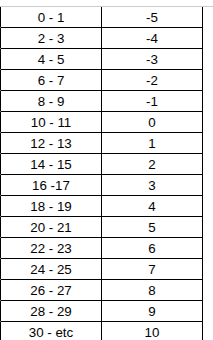

# Perguntas para Amadurecimento do Projeto (Questions)

Olá! Para garantirmos que a implementação do aplicativo seja impecável e respeite perfeitamente as regras da sua mesa, listei abaixo algumas dúvidas técnicas e conceituais sobre o sistema **Despertar do Caos** e as funcionalidades do app. 

Por favor, responda diretamente neste arquivo ou envie as respostas para que eu possa ajustar a arquitetura e as fórmulas do projeto.

---

## 1. Atributos e Distribuição de Pontos

1. **Os 80 pontos iniciais:**
   * O texto diz: *"cada jogador ganha 80 pontos em cada atributo para distribuir como quiser"*.
   * **Dúvida:** Isso significa que o jogador tem um total de **80 pontos para distribuir livremente entre os 8 atributos** (ex: colocar 10 em cada, ou 15 em uns e 5 em outros)? Ou cada atributo começa com um valor base e ele ganha 80 pontos no total? Ou cada atributo começa individualmente com 80 pontos?
- Resposta: Cada jogador recebe, inicialmente, 80 pontos para distribuir entre todos os atributos, então poderiam distribuir 10 pontos em cada atributo (existe uma esceção para Força de Vontade, q é um atributo exclusivo de certas classe, mas não vamos aplicar regras de negócio aqui, pq não tenho total conhecimento, então os players msm vão ver isso)

2. **Valor Mínimo e Máximo:**
   * Qual é o valor mínimo e máximo que um atributo pode ter na criação do personagem (ex: mínimo 0, máximo 20 ou máximo 100)?
- Resposta: O valor minimo é 0 e não temos um máximo por enquanto (seria possível criar um personagem com 80 de força, só seria estranho kkkk)

3. **Escala dos Atributos:**
   * O sistema de atributos usa a escala clássica de D&D 5e (valores comuns entre 8 e 20) ou utiliza uma escala de 0 a 100 (estilo sistemas percentuais)?
- Resposta: Normalmente usamos algo mais próximo de D&D, mas não seguimos exatamente a mesma escala, é como se os personagens nível 1 no rpg fossem nível 5 no livro, então não teremos personagens com atributos muito baixos

---

## 2. Fórmulas de Modificadores e Atributos

4. **Tabela de Modificadores:**
   * Como funciona o cálculo de modificadores de atributos em "Despertar do Caos"? É a mesma fórmula de D&D 5e ($\text{Mod} = \lfloor \frac{\text{Atributo} - 10}{2} \rfloor$) ou vocês usam uma tabela própria baseada no site? Se puder descrevê-la ou colá-la aqui, seria perfeito!
- Resposta: Usamos a formula do D&D, com essa tabela 

5. **Cálculo dos Pontos de Vida (FV):**
   * A fórmula é $\text{FV} = \text{Constituição} \times \text{Dado de Vida}$.
   * **Dúvida:** A "Constituição" usada aqui é o **valor bruto do atributo** (ex: se Constituição for 15, e o DV for d10 (10), a vida seria $15 \times 10 = 150$) ou é o **modificador de constituição**? Se for o modificador, como calculamos se o modificador for zero ou negativo?
- Resposta: A consituição usada é o valor bruto, exatamente como vc mostrou no exemplo de um DV 10 e 15 de constituição, daria 150 de FV

6. **Dados de Vida (DV) por Raça:**
   * Quais são os Dados de Vida (DV) associados a cada raça no seu cenário (ex: Anão = 10, Humano = 8, Murloc = 6)? Se puder listar as raças existentes e seus respectivos DVs, facilitará o cadastro inicial.
- Resposta: Infelizmente isso ainda está em construção, então de a possibilidade do player registrar o dado de vida manualmente ao criar um personagem (e eu não lembro de cabeça todas as opções, então não sei se caberia em um select, deixe um input numérico normal msm)

---

## 3. Mecânicas de Meca, Próteses e Recursos

7. **Vapor e Óleo:**
   * Como funcionam os recursos **Vapor** e **Óleo** na ficha? Eles são consumíveis (como pontos de mana que são gastos para usar habilidades e recuperados em descansos) ou são limites estáticos (ex: meu personagem tem capacidade para 5 pontos de próteses, e cada prótese instalada ocupa X de Vapor/Óleo)?
- Resposta: O vapor e óleo funcionam de forma semelhante aos pontos de mana, ambos são consumíveis e são recuperados comprando os consumíveis (mas não precisamos de uma mecanica de recuperação, só deixe possível q o palyer edite de forma genérica o valor de vapor e óleo q ele tem, pq é uma parte ainda em desenvolvimento)

8. **Órgãos Aperfeiçoados (Próteses):**
   * O que acontece mecanicamente quando um jogador ativa uma prótese (ex: Olho Esquerdo, Pulmão)? Elas adicionam bônus fixos a perícias/atributos ou fornecem habilidades ativas?
- Resposta: Depende da prótese, algumas fornecem algum bonus, então nas proteses é bom ter um nome, descrição e um campo de bonus proveniente da prótese

---

## 4. Variáveis de Sobrevivência (Fome, Sede, Radiação, etc.)

9. **Fome e Sede:**
   * F fome e sede começam em 50. O valor de 100 representa saciedade total ou fome/sede extrema?
   * Existem penalidades mecânicas automáticas caso esses valores cheguem a 0 (ou 100)?
- resposta: Isso, 0 seria fome extrema e 100 saciedade total, não existem penalidades mecanicas automáticas, então deixe de forma genérica o palyer editar, pq é uma parte ainda em desenvolvimento

10. **Radiação e Caos:**
    * O que acontece com o personagem quando o nível de **Exposição à Radiação** ou de **Caos** sobe? Há um limite máximo (ex: 100) onde o personagem sofre mutações, enlouquece ou morre?
- resposta: Existe o limite de 100, mas casos especiais podem fazer com que alguém supere esse limite, de forma geral, seria bom adicionar uma notificação ao mestre se um dos players chegarem a 100 de radiação ou caos ou 0 de fome ou sede (não existe penalidade automatica, mas existe uma consequencia que o mestre vai aplicar)

11. **Clima C° e Corpo C°:**
    * Estes campos de temperatura são meramente informativos para anotação em tempo real ou sofrem alguma interferência automática de alguma fórmula do sistema?
- resposta: Pura informação, não existe penalidade automatica, mas existe uma consequencia que o mestre vai aplicar

---

## 5. Curva de Experiência (XP) e Nível

12. **Passagem de Nível:**
    * No nível 1, a ficha mostra $0/100 \text{ XP}$. Qual é a quantidade necessária de XP para passar para o nível 3, 4, 5 e seguintes? Vocês usam uma progressão linear (ex: Nível $2 \rightarrow 3$ precisa de 200 XP, $3 \rightarrow 4$ precisa de 300 XP...) ou uma tabela específica?
- resposta: Ah quanto a isso, todos os jogadores iniciam no nível 0, para chegar no nível 1, leva 100 de xp, para ir do 1 para o 2, são 200, para ir do 2 pro 3 são 300 e assim por diante

---

## 6. Funcionalidades do Aplicativo e Fluxo de Jogo

13. **Evolução para Sistemas Genéricos:**
    * No futuro, você quer que o app suporte outros RPGs.
    * **Dúvida:** Devemos modelar o banco de dados de forma altamente dinâmica e genérica desde o primeiro dia (o que torna a codificação inicial um pouco mais lenta/complexa, mas facilita expandir depois), ou focamos em estruturar de forma fixa para o Despertar do Caos agora para entregar o app mais rápido e depois refatoramos?
- resposta: Vamos fazer de forma fixa por enquanto, no futuro refatoramos, a ideia por enquanto é ter algo utilizavel o mais rápido possível

14. **Processo de Login:**
    * O login simples será com E-mail/Senha tradicional ou deseja incluir login com Google/Discord/Apple?
- Resposta: Se fosse simples de aplicar, o perfeito seria aplicar login com google, mas para facilitar as coisas, um login de usuário e senha tradicional já resolve

15. **Notificações:**
    * O envio de notificações (XP recebido, novas sessões marcadas, aprovação de documentos) deve ser por notificações de sistema push (mesmo com o app fechado) ou notificações internas (in-app, mostradas apenas quando o app está aberto)?
- Resposta: Seria bom ter notificações internas e push, para que o player seja notificado mesmo com o app fechado

16. **O Diário dos Mortos:**
    * Quando o personagem morre, o diário fica público e a ficha bloqueada. Quem pode ver o diário? Qualquer pessoa da mesa ou o app terá uma seção pública geral na internet? Os outros jogadores devem receber um aviso imediato da morte (notificação)?
- Resposta:  Qualquer um da mesa deve poder conseguir ver o diário, mas a ficha somente o player que controlava o personagem e o mestre devem poder ver, e não precisa ter notificação de morte